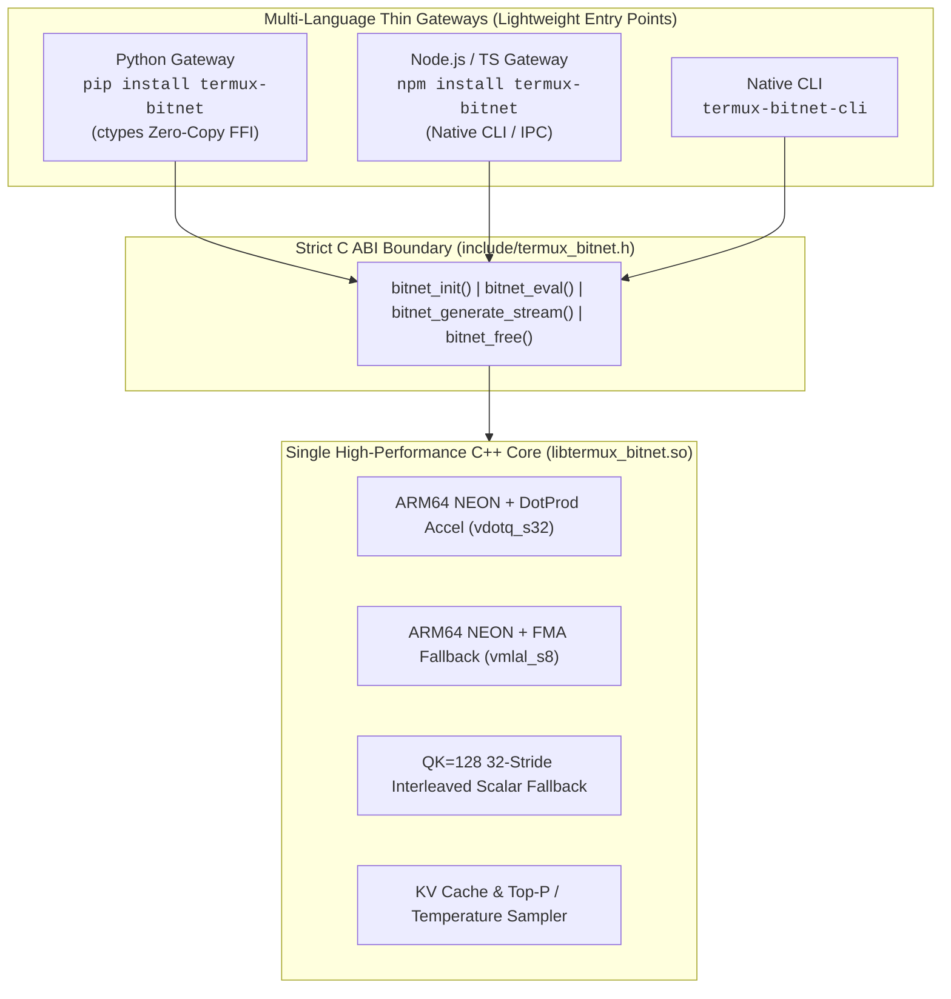

# termux-bitnet

> **Single C++ Core & Multi-Language Thin Gateways (Python SDK + Node.js npm) for 1.58-bit (i2_s) BitNet On-Device Inference on Android Termux & ARM64.**

<p align="center">
  <a href="https://pypi.org/project/termux-bitnet/"></a>
  <a href="https://pypi.org/project/termux-bitnet/"></a>
  <a href="https://www.npmjs.com/package/termux-bitnet"></a>
  <a href="https://www.npmjs.com/package/termux-bitnet"></a>
  <a href="https://www.npmjs.com/package/termux-bitnet"></a>
</p>

<p align="center">
  <a href="https://opensource.org/licenses/Apache-2.0"></a>
  
  
  
</p>

---

## 1. Architectural Philosophy: "Single C++ Core, Dual Thin Gateways"

`termux-bitnet` strictly adheres to the standard open-source AI systems design principle: **"All heavy computation, memory management, and tensor algebra are executed exclusively in a single high-performance C++ core, while Python (`pip`) and Node.js (`npm`) act as zero-overhead lightweight entry points (Thin Gateways / FFI Boundaries)."**



---

## 2. Verified BitNet Model Registry

`termux-bitnet` supports verified official and community 1.58-bit GGUF models on Hugging Face. Download and cache models with single-command HTTP Range resume support:

| Alias | Source Repository & Model File | Parameters / Size | Highlights |
|---|---|---|---|
| `bitnet-2b` | `microsoft/bitnet-b1.58-2B-4T-gguf` | 2.4B / **1.13 GB** | Microsoft Official Flagship 1.58-bit Model (Mobile Recommended) |
| `bitnet-large` | `RichardErkhov/1bitLLM_-_bitnet_b1_58-large-gguf` | 0.7B / **404 MB** | Ultra-lightweight model for low-spec mobile/Termux devices |
| `bitnet-3b` | `Green-Sky/bitnet_b1_58-3B-GGUF` | 3.3B / **730 MB** | High-precision on-device 3B BitNet model |
| `bitnet-3b-q4` | `RichardErkhov/1bitLLM_-_bitnet_b1_58-3B-gguf` | 3.3B / **1.83 GB** | Q4 quantized high-performance 3B model |

```bash
# One-touch download with HTTP resume support
termux-bitnet download bitnet-2b
```

---

## 3. Quick Start

### 3.1 Python Gateway (`pip`)

```bash
# Install Python package
pip install termux-bitnet

# Run inference CLI with full parameter matrix control
termux-bitnet run -m ~/.cache/termux-bitnet/models/bitnet-2b-ggml-model-i2_s.gguf   -p "The capital of France is"   -t 8 -c 2048 -n 128 --temp 0.7 --top-p 0.95 --top-k 40 --repeat-penalty 1.15
```

```python
from termux_bitnet import BitNetEngine, BitNetConfig

config = BitNetConfig(
    model_path="~/.cache/termux-bitnet/models/bitnet-2b-ggml-model-i2_s.gguf",
    n_threads=8,
    temperature=0.7,
    top_p=0.95,
    top_k=40,
    min_p=0.05,
    repeat_penalty=1.15,
)

with BitNetEngine(config) as engine:
    for token in engine.generate_stream("Write a Python palindrome check:"):
        print(token, end="", flush=True)
```

---

### 3.2 Node.js Gateway (`npm`)

```bash
# Install npm package
npm install termux-bitnet

# Run Node.js CLI
npx termux-bitnet run -p "Explain harmonic mean in one sentence" -t 8 --temp 0.7 --top-p 0.95
```

```javascript
const { createEngine } = require('termux-bitnet');

async function main() {
  const engine = createEngine({
    threads: 8,
    temperature: 0.7,
    topP: 0.95,
    topK: 40,
    repeatPenalty: 1.15,
  });
  
  await engine.generateStream('Question: Explain harmonic mean:', 128, (token) => {
    process.stdout.write(token);
  });
}

main();
```

---

## 4. Full Parameter Matrix

| CLI Flag | Python (`BitNetConfig`) | Node.js (`BitNetOptions`) | C ABI (`bitnet_params_t`) | Default | Description |
|---|---|---|---|---|---|
| `-m, --model` | `model_path` | `modelPath` | `model_path` | `""` | Path to GGUF model binary |
| `-p, --prompt` | `prompt` | `prompt` | `prompt` | `""` | Input prompt text |
| `-t, --threads` | `n_threads` | `threads` | `n_threads` | `cores` | Number of CPU worker threads |
| `-c, --ctx-size` | `n_ctx` | `contextSize` | `n_ctx` | `2048` | KV Cache context window size |
| `-b, --batch-size`| `n_batch` | `batchSize` | `n_batch` | `512` | Prompt evaluation batch size |
| `-n, --n-predict` | `n_predict` | `maxTokens` | `n_predict` | `128` | Maximum tokens to generate |
| `--temp` | `temperature` | `temperature` | `temperature` | `0.7` | Softmax temperature (0.0 = Greedy) |
| `--top-p` | `top_p` | `topP` | `top_p` | `0.95` | Nucleus Top-P sampling cutoff |
| `--top-k` | `top_k` | `topK` | `top_k` | `40` | Top-K sampling cutoff |
| `--min-p` | `min_p` | `minP` | `min_p` | `0.05` | Min-P relative probability cutoff |
| `--repeat-penalty`| `repeat_penalty` | `repeatPenalty` | `repeat_penalty` | `1.15` | Repetition penalty coefficient |
| `-s, --seed` | `seed` | `seed` | `seed` | `0` | Random seed (0 = non-deterministic) |
| `--system-prompt` | `system_prompt` | `systemPrompt` | `system_prompt` | `""` | Optional system prompt prefix |
| `-r, --stop` | `stop_tokens` | `stopTokens` | `stop_tokens` | `""` | Stop sequence tokens |

---

## 5. Direct C ABI Embedding (C/C++)

```c
#include "termux_bitnet.h"
#include <stdio.h>

int main() {
    bitnet_params_t params = bitnet_default_params();
    params.temperature = 0.7f;
    params.top_p = 0.95f;
    params.top_k = 40;
    bitnet_context_t ctx = bitnet_init(&params);

    bitnet_generate_stream(ctx, "The capital of France is", 64, 
        [](const char* token, int32_t id, void* u) {
            printf("%s", token);
            return true;
        }, NULL);

    bitnet_free(ctx);
    return 0;
}
```

---

## 6. License

Apache License 2.0. Copyright (c) 2026 uno-km.
